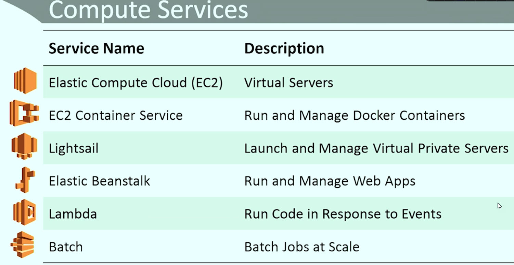
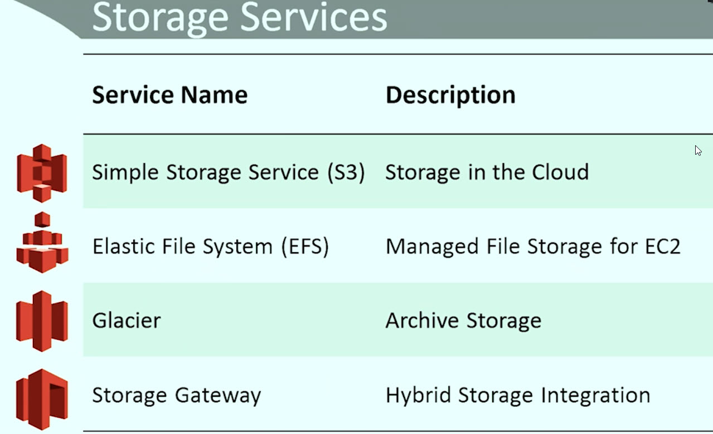
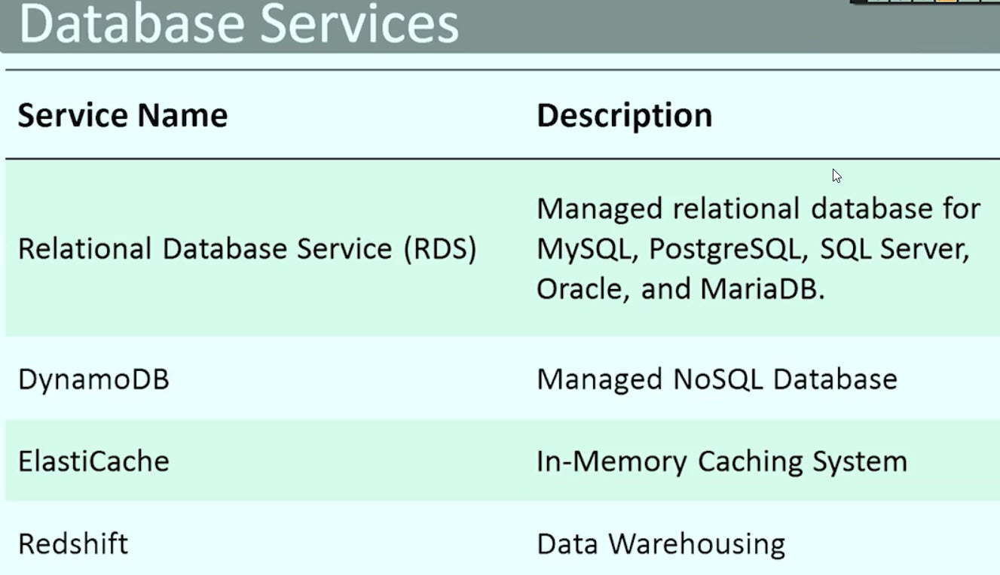
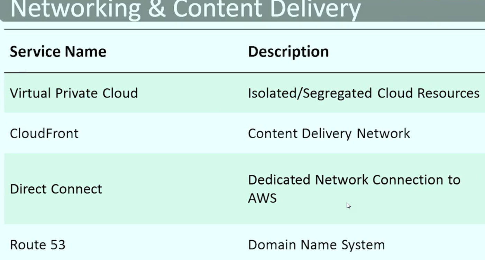
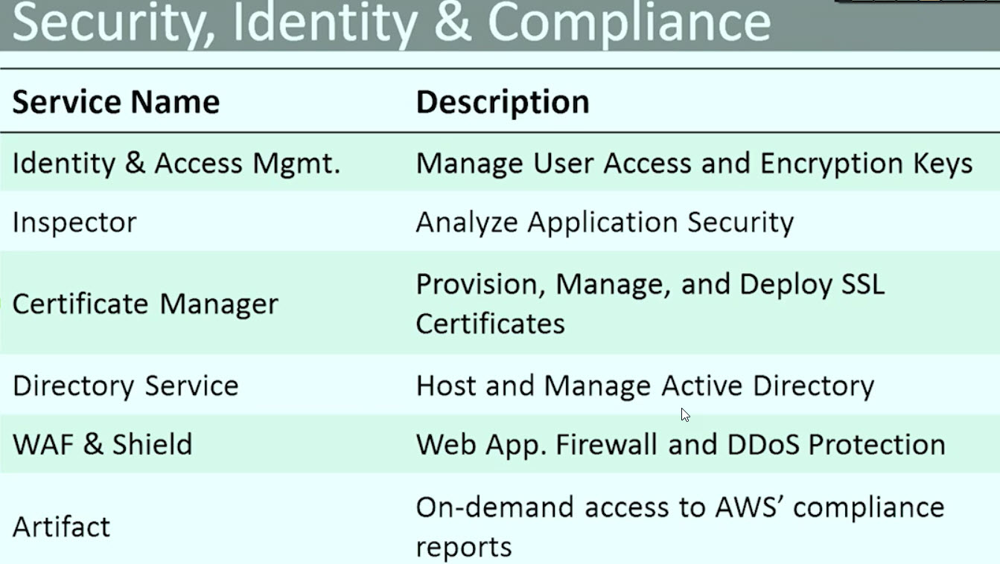

## Installing AWS command line
    1. install python first
        C:\Users\Admin>python --version
        Python 3.7.0
    2. install awscli by :- 
        C:\Users\Admin>pip install awscli
        Collecting awscli
    3. one can configure/login by running
        C:\Users\Admin>aws configure
        AWS Access Key ID [None]:
    4. Once login, you can run aws commands : 
        C:\Users\Admin>aws --output table ec2 describe-instances
        C:\Users\Admin>aws --output text ec2 describe-instances
        C:\Users\Admin>aws --output json ec2 describe-instances
        C:\Users\Admin>aws dynamodb scan --table-name=AWSDevGuru 
        C:\Users\Admin>aws dynamodb scan --output --table-name=AWSDevGuru 

## AWS deveopmet using python

## Installing AWS SDK for python
        D:\projects\aws>pip install boto3
        Collecting boto3
          Downloading https://files.pythonhosted.org/packages/03/31/d42ccaca6902c19eb40efe174b9c364612b1693fe94b905172bf943d65a1/boto3-1.7.54-py2.py3-none-any.whl (128kB)
            100% |████████████████████████████████| 133kB 521kB/s
        Requirement already satisfied: jmespath<1.0.0,>=0.7.1 in c:\users\admin\appdata\local\programs\python\python37\lib\site-packages (from boto3) (0.9.3)
        Requirement already satisfied: s3transfer<0.2.0,>=0.1.10 in c:\users\admin\appdata\local\programs\python\python37\lib\site-packages (from boto3) (0.1.13)
        Requirement already satisfied: botocore<1.11.0,>=1.10.54 in c:\users\admin\appdata\local\programs\python\python37\lib\site-packages (from boto3) (1.10.54)
        Requirement already satisfied: python-dateutil<3.0.0,>=2.1; python_version >= "2.7" in c:\users\admin\appdata\local\programs\python\python37\lib\site-packages (from botocore<1.11.0,>=1.10.54->boto3) (2.7.3)
        Requirement already satisfied: docutils>=0.10 in c:\users\admin\appdata\local\programs\python\python37\lib\site-packages (from botocore<1.11.0,>=1.10.54->boto3) (0.14)
        Requirement already satisfied: six>=1.5 in c:\users\admin\appdata\local\programs\python\python37\lib\site-packages (from python-dateutil<3.0.0,>=2.1; python_version >= "2.7"->botocore<1.11.0,>=1.10.54->boto3) (1.11.0)
        Installing collected packages: boto3
        Successfully installed boto3-1.7.54
        
        D:\projects\aws>

## AWS deveopmet using nodejs
        D:\projects\aws>npm install --save aws-sdk
        npm WARN saveError ENOENT: no such file or directory, open 'D:\projects\aws\package.json'
        npm notice created a lockfile as package-lock.json. You should commit this file.
        npm WARN enoent ENOENT: no such file or directory, open 'D:\projects\aws\package.json'
        npm WARN aws No description
        npm WARN aws No repository field.
        npm WARN aws No README data
        npm WARN aws No license field.
        
        + aws-sdk@2.271.1
        added 15 packages in 17.066s

|Amazon Service - there are 100 plus|
|------------ | 
 
 
 
 
 

