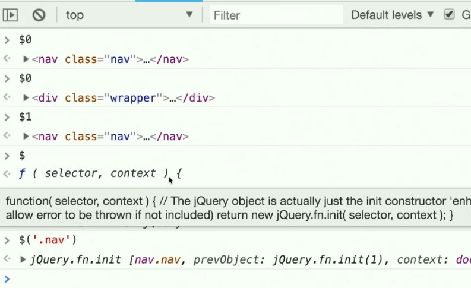
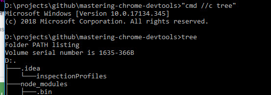
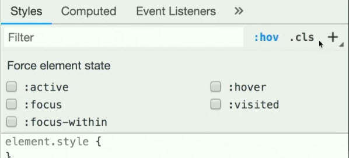

|ChromePlugin | Description | 
|------------ | ------------- |
|Extension | chrome://extensions/ | 
| chrome-devtools Video| [mastering-chrome-devtools](https://github.com/jkup/mastering-chrome-devtools) |
| CSS rules explained| [specifishity](http://specifishity.com/) |
| tree| https://superuser.com/questions/531592/how-do-i-add-the-tree-command-to-git-bash-on-windows |

|Chrome Shotcuts | Description | 
|------------ | ------------- |
|Escape | Any time opens the console window in dev tools- One more time escape with hides theconsole window again | 
|Blackbox | Use blackboxing patter to avoid library call stack or debugger going in to that codebase..| 
| $| Writes the context of element selected plust $ is jquery and can select like jquery |
| tree command | |
| Force element state|  |
| Computed Style| Use computed style to see what ist he final css applied, Event listener beside computed shows the events applied to this page|

