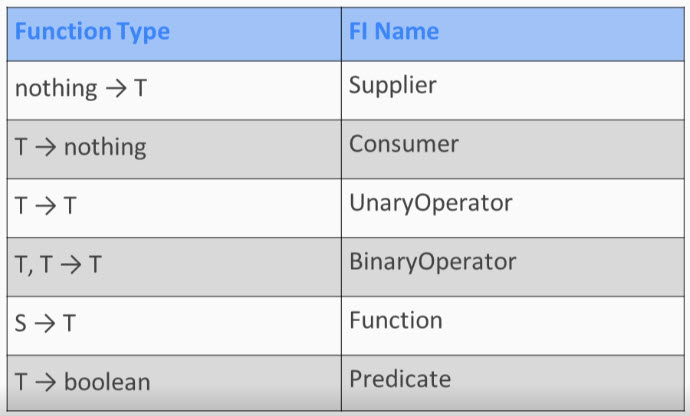
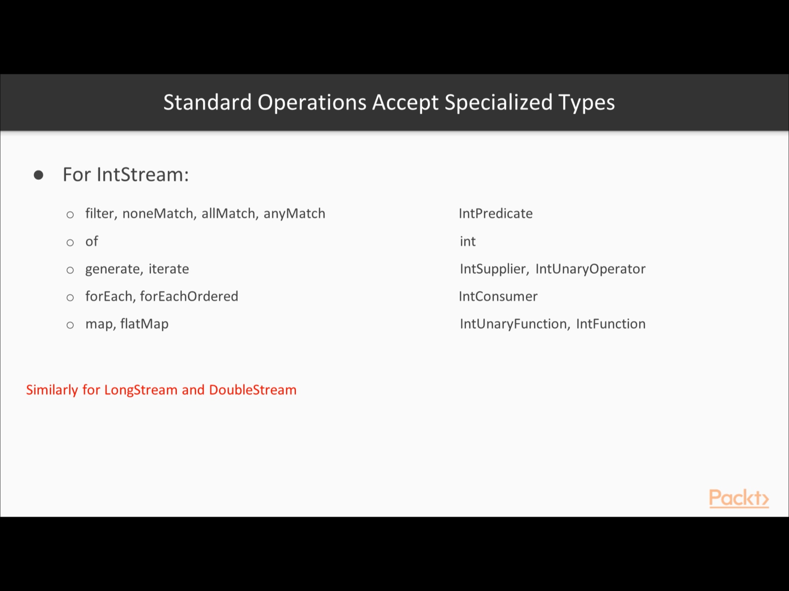
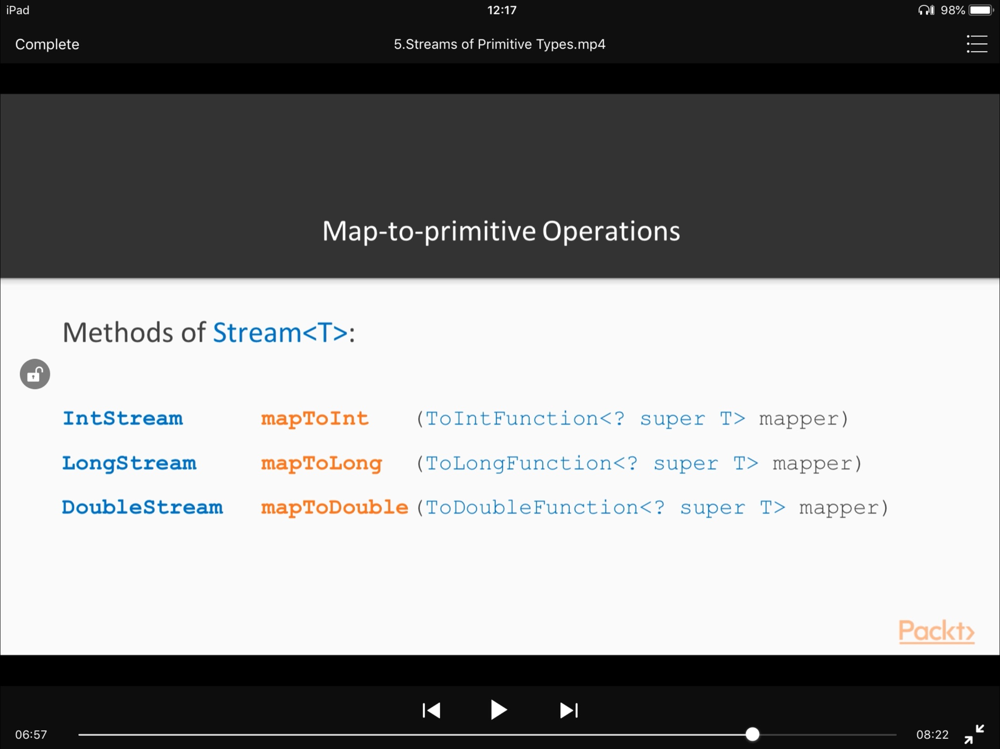
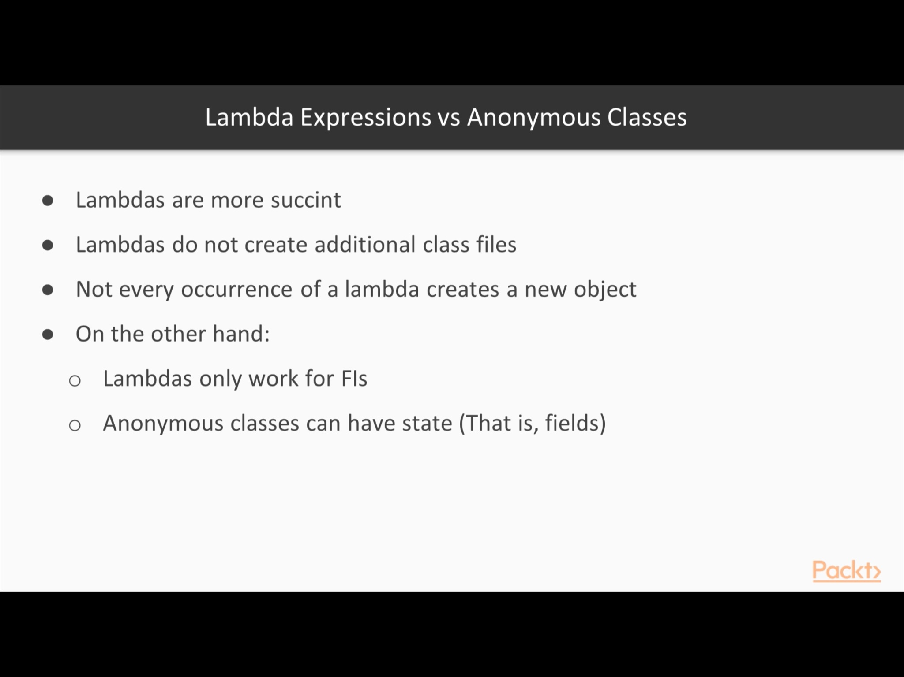
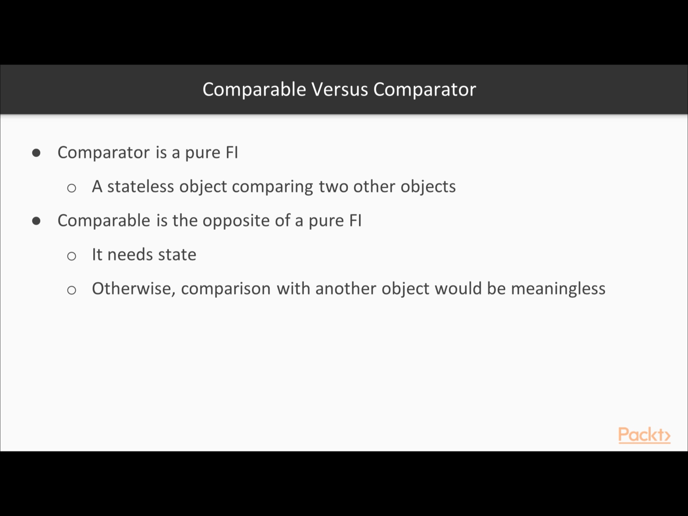

|There are 40 Functional interfaces, categoriesed as bellow|
|------------ | 
 
 
 
 

|Special treatement and functionality for primitive types|
|------------ | 
 
 

|Core java concepts associated with functional interface|
|------------ | 
 
 

# Functional Interface -  Predicate |
------------          |
        [1]     
        public static final Predicate<String> EVENS = s -> s.length() % 2 == 0;

        [2] Predicate defined and returned.
          public static Predicate<Car> getRedCarCriterion() {
            return RED_CAR_CRITERION;
          }
        
          private static final Predicate<Car> RED_CAR_CRITERION
              = c -> c.color.equals("Red");
              
              
         [3] use lambda to return functional behaviour
           private static final Comparator<Car> fuelComparator = (o1, o2) -> o1.gasLevel - o2.gasLevel;
     
        
### This is how runnable is returned. See no mentioning of run, just method return time decides

    '''
    private static Runnable getRunnable() {
            return () -> {
                try {
                    TimeUnit.SECONDS.sleep(5);
                } catch (InterruptedException e) {
                    e.printStackTrace();
                }
                String threadName = Thread.currentThread().getName();
                System.out.println("Hello " + threadName);
            };
        }
    '''
    