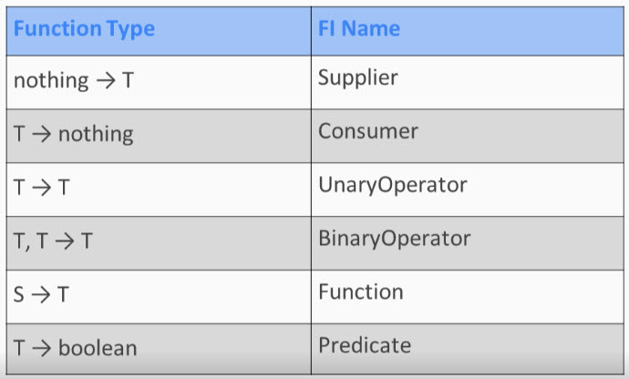
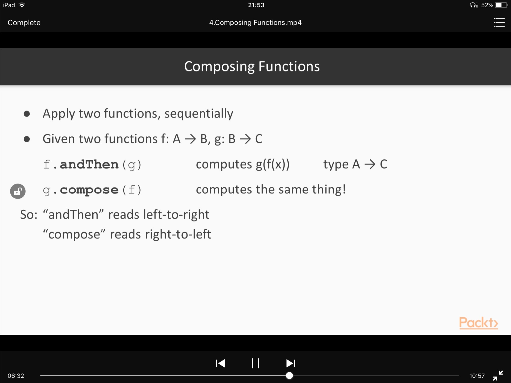
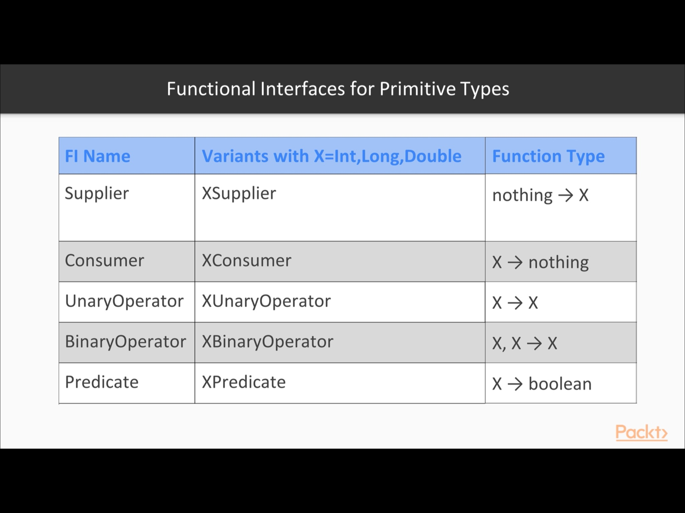
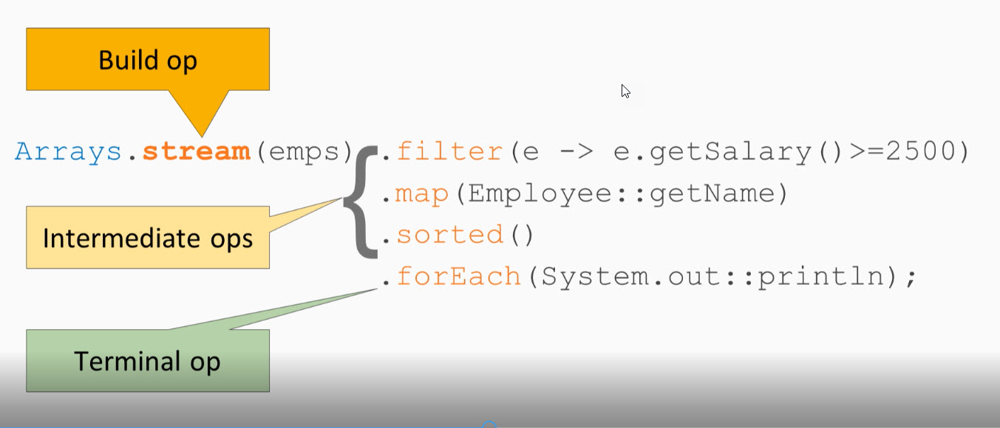
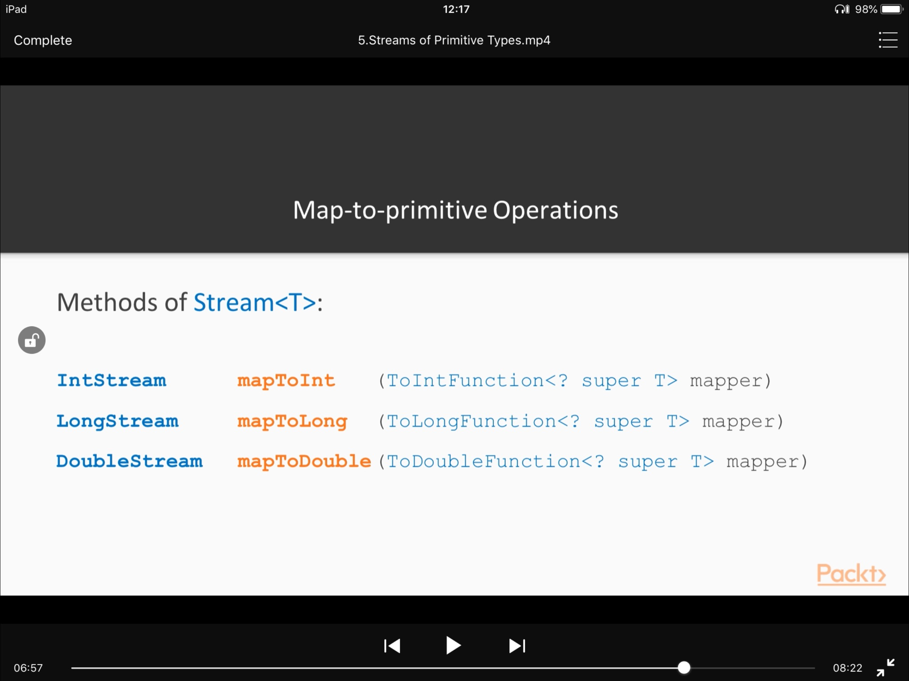
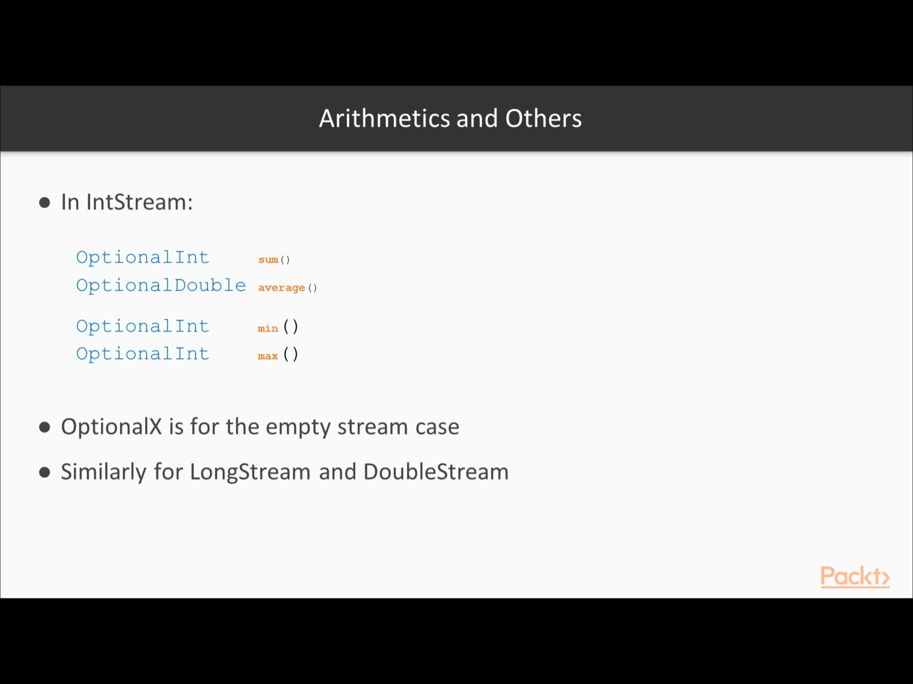
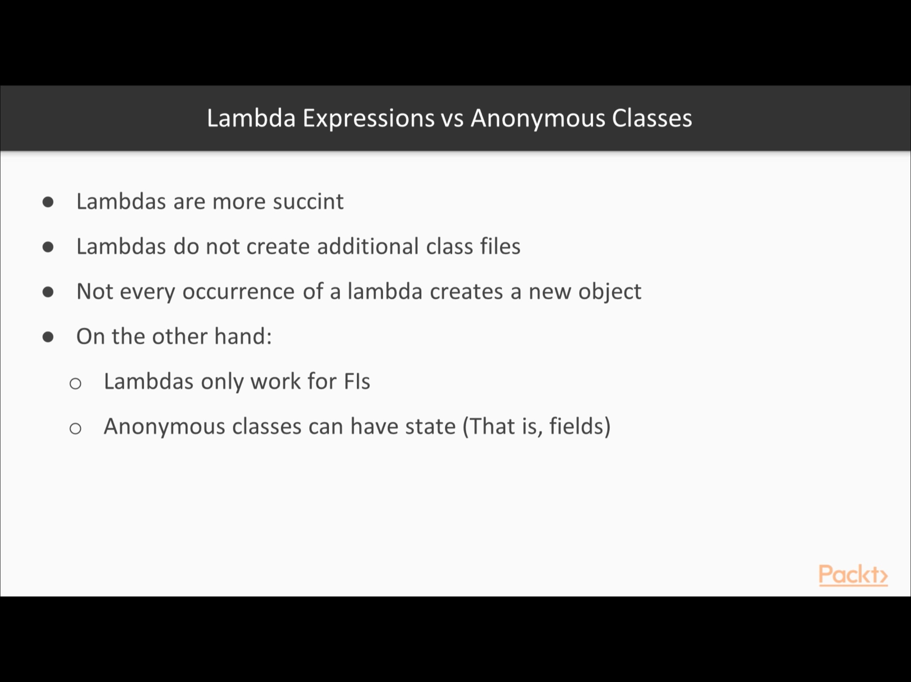
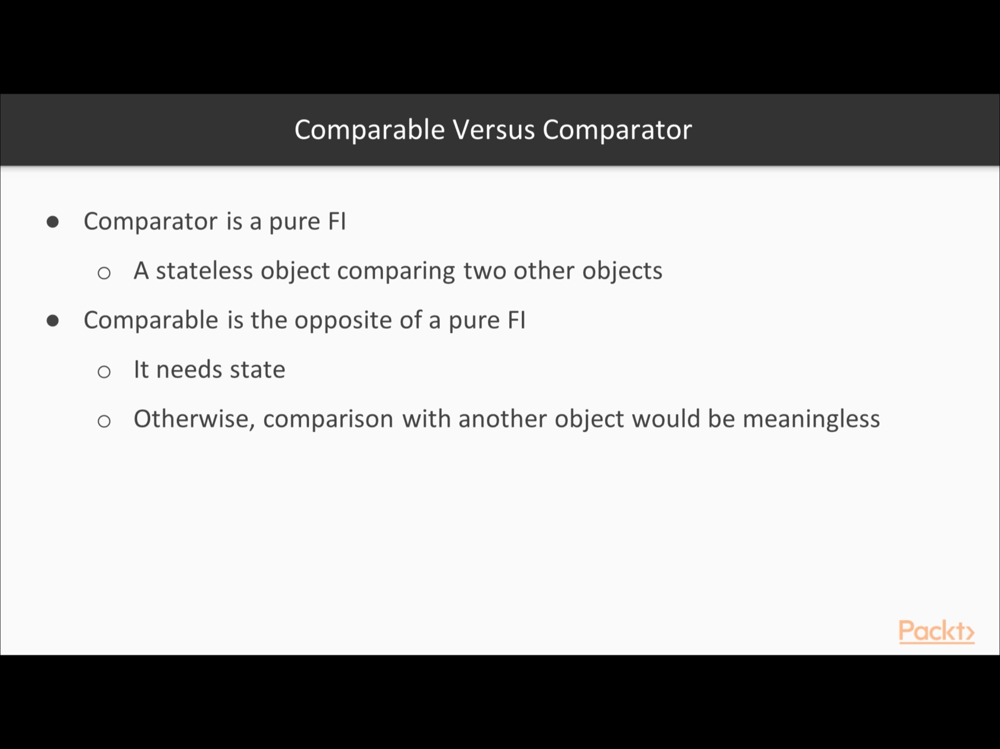

|Sr No| Usage 
|------------ | 
| 1. | |
| |
| |
| |
| |
| |
| |
| |
| |

|ExpectedException : Help us to do assert message text after exception is thrown |
|------------ | 
     @Rule
     public ExpectedException thrown = ExpectedException.none();

     @Test
     public void createWhenVinIsNullShouldThrowException() throws Exception {
       this.thrown.expect(IllegalArgumentException.class);
       this.thrown.expectMessage("VIN must not be null");
       new VehicleIdentificationNumber(null);
     }
