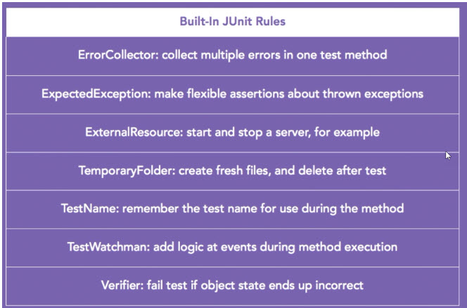

### Useful Links
- :sunglasses: [In 28 Mins junit](https://github.com/in28minutes/spring-unit-testing-with-junit-and-mockito)
- [naming standards for unit tests](http://osherove.com/blog/2005/4/3/naming-standards-for-unit-tests.html)
   
   

|Spring annonotation | Description | 
|------------ | ------------ | 
|@Configuration |It overrides @SpringBootConfiguration class config. This requires us to provide context bean for each requried bearn |
|@TestConfiguration |Adds extra configuration on top of  @SpringBootConfiguration  |
|@MockBean | Replaces of adds a mock bean to the ApplicationContext. It takes care of a) reseting the mock ( no need for @DirtiesContext) b) context cache issues c) AOP issues|
|@SpyBean | Can be used spy bean only if it is already available in context |
|@JsonTest | Use to test JSON marshalling and unmarshalling , Auto configures jackson/GSON, Proviedes JacksonTester/GsonTester |

|Built in Rules | 
|------------ | 
| |

|ExpectedException : Help us to do assert message text after exception is thrown |
|------------ | 
     @Rule
     public ExpectedException thrown = ExpectedException.none();

     @Test
     public void createWhenVinIsNullShouldThrowException() throws Exception {
       this.thrown.expect(IllegalArgumentException.class);
       this.thrown.expectMessage("VIN must not be null");
       new VehicleIdentificationNumber(null);
     }
|Library which has custom defined Rules : | 
|------------ | 
|
    testCompile "com.github.stefanbirkner:system-rules:1.5"
     
     import org.junit.contrib.java.lang.system.StandardOutputStreamLog;
     
     @Rule
     public final StandardOutputStreamLog log = new StandardOutputStreamLog();
     
     
     
     Prefer using Assert library then hamcrest as it gives support of better IDE intellisense and lesser import clutter.
     
     import static org.assertj.core.api.Assertions.assertThat;
     assertThat(this.dto.toString())
          .isEqualTo("Danger Mouse - 221c Baker Street, London");
 
|                     
 

|Using ContextConfiguration in Spring test class to load configuration form Production or Test Classes| 
|------------ | 
|
    @RunWith(SpringJUnit4ClassRunner.class)
    @ContextConfiguration(classes=CDPlayerConfig.class)
    public class CDPlayerTest {
   
    @Autowired
    private MediaPlayer player;
   
    @Autowired
    private CompactDisc cd;
   
######In above standard and vanilla test junit class, CDPlayerConfig.class is the not production configuration class which defines the beans, where autowire in test class loads them.|

|@Capture and @Answer| 
|------------ | 
   
    @RunWith(MockitoJUnitRunner.class)
    public class CaptorAnnotationTest {
    
      @Captor
      ArgumentCaptor<List<String>> captor;
      @Mock Service service;
     
      @Test
      public void when_captor_annotation_is_used() throws Exception {
         service.call(Arrays.asList("a","b"));
         verify(service).call(captor.capture());
         assertTrue(captor.getValue().containsAll(Arrays.asList("a","b")));
      }
    }
    
    
    Other way to create capture
    
    public void when_capturing_variable_args() throws Exception {
      String[] errorCodes = {"a","b","c"};
     
      ArgumentCaptor<String> captor = ArgumentCaptor.forClass(String.class);
      repository.lookUp(errorCodes);
      verify(repository).lookUp(captor.capture(),captor.capture(),captor.capture());
      assertTrue(captor.getAllValues().containsAll(Arrays.asList(errorCodes)));
    }
    
    
    
    
    @Answer
    doAnswer(new Answer<Error>() {
    
      @Override
      public Error answer(InvocationOnMock invocation) throws Throwable {
         Error err = (Error)invocation.getArguments()[0];
         err.setErrorCode("123");
         return err;
      }
    }).when(errorHandler).mapTo(isA(Error.class));
    
    
    @ArgumentMatcher
    
    class BlueChipStockMatcher extends ArgumentMatcher<String> {
      @Override
      public boolean matches(Object symbol) {
         return "FB".equals(symbol) || "AAPL".equals(symbol);
      }
    }
    
    Use like this :
    
    when(marketWatcher.getQuote(argThat(new BlueChipStockMatcher())))
         .thenReturn(blueChipStock);
    
 
|Integration testing| 
|------------ | 
######Integration testing : The way we have surefire plugin for junit, maven-failsafe-plugin is for integration testing. The class which is to be included for integration testing should start with IT 
    <build>
      <plugins>
         <plugin>
            <groupId>org.springframework.boot</groupId>
            <artifactId>spring-boot-maven-plugin</artifactId>
         </plugin>
         <plugin>
            <groupId>org.apache.maven.plugins</groupId>
            <artifactId>maven-surefire-plugin</artifactId>
            <configuration>
               <includes>
                  <include>**/*Tests.java</include>
                  <include>**/*Test.java</include>
                  <include>**/Test*.java</include>
               </includes>
               <excludes>
                  <exclude>**/Abstract*.java</exclude>
               </excludes>
            </configuration>
         </plugin>
         <plugin>
            <groupId>org.apache.maven.plugins</groupId>
            <artifactId>maven-failsafe-plugin</artifactId>
            <executions>
               <execution>
                  <goals>
                     <goal>integration-test</goal>
                     <goal>verify</goal>
                  </goals>
               </execution>
            </executions>
         </plugin>
      </plugins>
    </build>

|Load property from properties file & get Spring configuration | 
|------------ | 
    @Configuration
    @PropertySource("classpath:/com/soundsystem/app.properties")
    public class EnvironmentConfig {
    
     @Autowired
     Environment env;
    
    public class DataSourceConfigTest {
    
     @RunWith(SpringJUnit4ClassRunner.class)
     @ContextConfiguration(classes=DataSourceConfig.class)
     @ActiveProfiles("dev")
     public static class DevDataSourceTest {
       @Autowired
       private DataSource dataSource;
    
    
###### We can always get context in junit
    @Autowired
    private ApplicationContext context;

|To ignore getting beans from @configuration| 
|------------ | 
    @Configuration
    @ComponentScan(excludeFilters={@Filter(type=FilterType.ANNOTATION, value=Configuration.class)})
    public class ComponentScannedConfig {
    
    }

