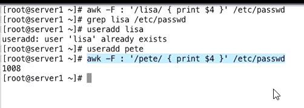
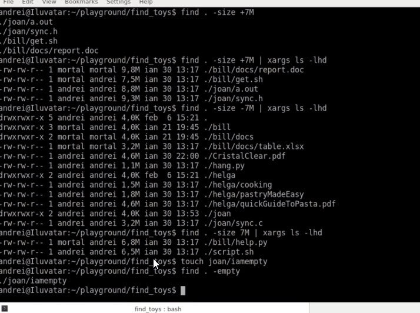

# du
    du -h | sort -rn | head
    here -h human readable, -rn reverse sized    

# awk

# cut

    cut -f 2 -d : /etc/passwd 
    # here -f 2 is second field and -d : is deliminator as column
# grep

    grep -e 'what' -e 'else' *
    # -e is egrep - matches more regular expression
    
    grep -A5 
    shows five line after matching the regex
     
    grep -B4 
    shows four line before matching the regex
    

    
    

# input/output/errorout
    Admin@DESKTOP-2V0SC6I MINGW64 /d/projects/github/notes (master)
    $ ls junit README.md notExists.txt 1> out.txt 2>error.txt
    
    Admin@DESKTOP-2V0SC6I MINGW64 /d/projects/github/notes (master)
    $ cat error.txt
    ls: cannot access 'notExists.txt': No such file or directory
    
    Admin@DESKTOP-2V0SC6I MINGW64 /d/projects/github/notes (master)
    $ ls junit README.md notExists.txt 1> out.txt 2>&1
    
    Admin@DESKTOP-2V0SC6I MINGW64 /d/projects/github/notes (master)
    $ cat out.txt
    ls: cannot access 'notExists.txt': No such file or directory
    README.md
    
    junit:
    images/
    README.md
    
    Admin@DESKTOP-2V0SC6I MINGW64 /d/projects/github/notes (master)
    $ cat error.txt
    ls: cannot access 'notExists.txt': No such file or directory
    
    Admin@DESKTOP-2V0SC6I MINGW64 /d/projects/github/notes (master)
    $
    Admin@DESKTOP-2V0SC6I MINGW64 /d/projects/github/notes (master)
    $ cat out1.txt
    ls: cannot access 'notExists.txt': No such file or directory
    README.md
    
    junit:
    images/
    README.md
    
    Admin@DESKTOP-2V0SC6I MINGW64 /d/projects/github/notes (master)
    $ ls junit README.md notExists.txt 2>/dev/null
    README.md
    
    junit:
    images/  README.md

    Admin@DESKTOP-2V0SC6I MINGW64 /d/projects/github/notes (master)
    $ cat <<NUMS
    > whatever you type
    > until you write nums in upper case
    > NUMS
    whatever you type
    until you write nums in upper case
    
    Admin@DESKTOP-2V0SC6I MINGW64 /d/projects/github/notes (master)
    $ cat <<NUMS >redirect.txt
    > whatever you type
    > it will get saved
    > in to the files redirect.txt
    > NUMS
    
    Admin@DESKTOP-2V0SC6I MINGW64 /d/projects/github/notes (master)
    $ cat redirect.txt
    whatever you type
    it will get saved
    in to the files redirect.txt
    
    Admin@DESKTOP-2V0SC6I MINGW64 /d/projects/github/notes (master)
    $ sudo passwd testuser --stdin <<< "testpass"
    Admin@DESKTOP-2V0SC6I MINGW64 /d/projects/github/notes (master)
    $

    Admin@DESKTOP-2V0SC6I MINGW64 /d/projects/github/notes (master)
    $ ls filenotpresent.txt
    ls: cannot access 'filenotpresent.txt': No such file or directory
    
    Admin@DESKTOP-2V0SC6I MINGW64 /d/projects/github/notes (master)
    $ echo $?
    2

    
    