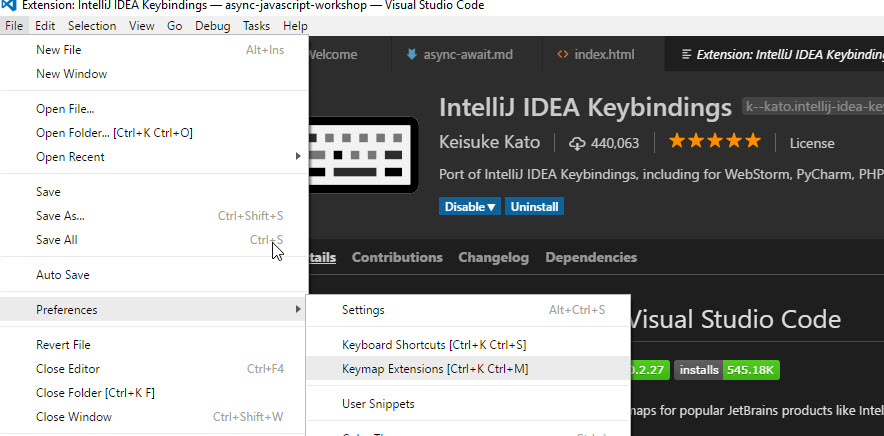
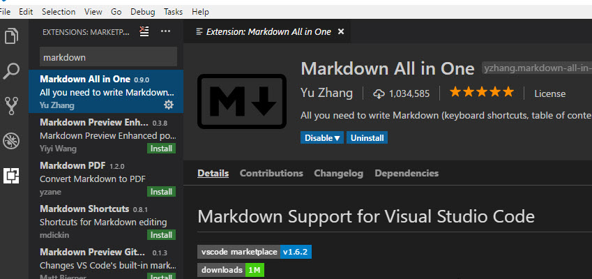
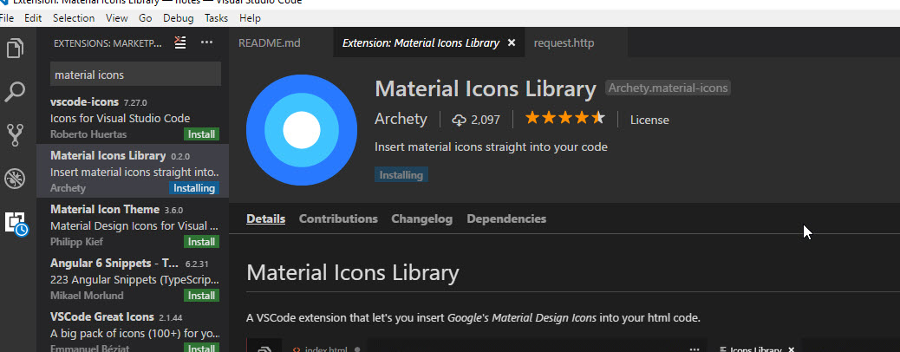
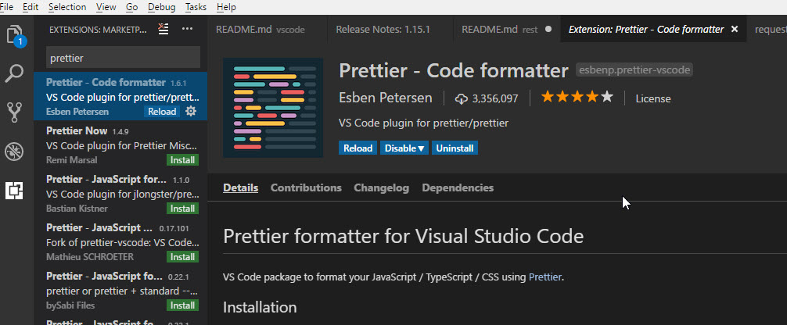
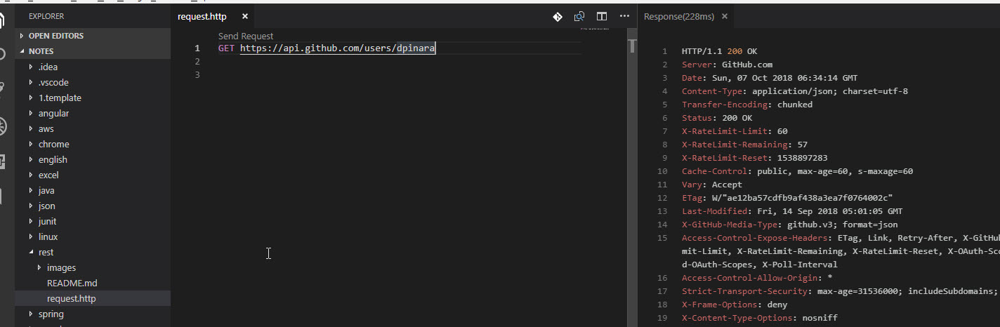
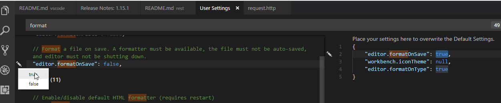

### Useful Links
- sunglasses [vscode pluralsight tutorial author gitbub](https://github.com/viatsko/awesome-vscode)
   
   

| Short cut    | Description         |
| ------------ | ------------------- |
| Ctrl+Shift+A | Opens pallet on top |

| plugin name                              | Description                       |
| ---------------------------------------- | --------------------------------- |
| IDEA ShortCuts ( @recommended:keymaps  ) |  |
| Markdown ( @recommended:keymaps  )       |       |
| Material Icon        |       |
| Prettier - Code formatter.        |       |
| Rest Client : File name should be .http, .rest        |       |

| Editor set up                              | Description                       |
| ---------------------------------------- | --------------------------------- |
| <b>User settings</b> : search anything which you wish to change. click on the gutter and select from the available option which you wish to change|  |

